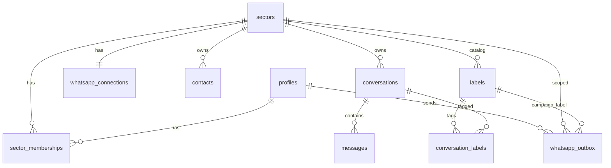

# Architecture — WhatsApp CRM Template

## Summary

Multi-agent WhatsApp CRM template for **one or more** WhatsApp Business numbers (tenants), **single repo** and single Next.js panel. **Multi-provider:** Baileys sectors use session on **GCP Always Free** `e2-micro` VM + worker-drained outbox; Cloud API sector (e.g., Kapso) uses **Cloud API via provider** (no VM, webhook + HTTP). Postgres (Supabase) is the source of truth; panel reads/writes via Data API + Realtime. See ADR 008.

**v1 (closed 2026-08-26):** inbox 1:1 live, send, ticks, labels, admin users/channel.

**v2 (closed 2026-08-27):** WhatsApp Web-like UX polish + agenda names + new chat + groups + replies + voice recording + Favorites (WA label) + avatars/initials. Single contract; slices S9–S14 in writing plan.

**Mobile + PWA (wave S17, approved 2026-09-14):** panel usable on phones / widths <768px and installable as PWA standalone (manifest + shell service worker). **No** Web Push (still deferred → **hermes-pwa-push**).

**Egress Free (wave S18):** reduce Supabase free tier egress consumption (target **$0 cost**, no Pro). Worker **event-driven** (Realtime) + safety poll; inbox list via Realtime **diff**. Move to another Free org only if restricted (S18c conditional; cancelled this cycle).

**Multi-sector (wave S19+, approved 2026-09-14):** second number for another tenant; separate inboxes and users; same domain; Path A (same Supabase). See ADR 005. Details below.

**Native read (ADR 004 amended 2026-09-16, S24–S25):** operational read/unread = native MD unread (phone, WhatsApp Web, CRM). WA "Unread" label is CRM projection/filter, not a separate truth. External attribution: "Read from phone".

**Campaign labels (wave S26–S27, approved 2026-09-17):** collections creates/lists Business labels **per sector** (RPCs `service_role`), freezes id in campaign, passes via `enqueue_sector_text` (`p_crm_label_id`); worker assigns to thread **only AFTER SENT**, with real Business mirror (same pattern as inbox toggle). Catalog create: optimistic via worker (`addLabel`); if smoke fails → fail-fast fallback (only pre-existing WA labels).

**UI Lists in chat menu (wave S28, approved 2026-09-17):** from ⋮ on each row in inbox → **Add to list** (all sector lists, toggle assign/remove Business mirror) + **+ New list** (name only; WA default color `0`; optimistic create authed → same `whatsapp_label_catalog_ops` queue). Reuses thread Lists modal pattern; no new settings.

**Cloud API Channel / Kapso (ADR 008, approved 2026-09-21):** sector `kapso-8257` (**Collections · Kapso**), number `5493469698257` (same as Collections Kapso + GAS). Human 1:1 support in this CRM; full number history (inbound + CRM outbound + Collections/GAS outbound). No Baileys VM; R1 dual webhooks with Collections; no campaigns/bot in this repo. Slices K* in writing plan.

**Inbound sound (wave S29, approved 2026-09-21):** short beep in panel when inbound arrives in another chat; mute/unmute toggle in list header; preference in `localStorage` **per sector**; default ON. Client-only (existing Realtime); no Web Push; no Baileys/worker changes except reading `direction` in client payload.

**Overflow reveal (wave S30–S31, approved 2026-09-21):** when text data is truncated (ellipsis/overflow), on **desktop** a reusable tooltip pattern reveals full value on hover/focus — **only if** node is actually truncated. **Touch/mobile: no overflow tooltip** (long-press remains menu; full data seen by opening thread or other surface). No layout redesign; no Tooltip library; portal + generic tokens. Read-only (no copy in tooltip).

**Free Fleet + Turnos SAMCO (wave S32–S35, approved 2026-09-25):** (1) **Anti-Meta health** of live Contable Baileys + Kapso channels (checklist + 7 days incident-free) before scaling. (2) **Reduce Log Ingest** Free (Postgres/pooler config + fewer REST from worker safety poll). (3) CRM sector **`turnos-samco` / Turnos · SAMCO** (Baileys, VM `facturacionsamcoacebal@gmail.com`). (4) 24h / 2h reminders: logic and tables in **guardia_samco** repo; **single** Baileys process on that VM (dual-DB). Eq-technical / Treasury remain no-QR this wave. Egress Free comfortable; Log Ingest is the quota to watch.

## Users and goals

- **Agentes:** personal de oficina por **sector** (membership). Google allowlist. Ven solo la bandeja del sector activo; envían, etiquetan y retoman conversaciones de ese número.
- **Admin global (Percy, `your-admin@domain.com`):** membership a los sectores; conectar/desconectar QR de sectores **Baileys**; ver estado WABA/Kapso del sector Kapso; gestionar usuarios y memberships.
- **Vecinos:** no usan el panel; escriben al número del sector correspondiente.
- **Éxito medible (v1):** el equipo atiende 1:1 desde el panel sin WhatsApp Web; cada mensaje saliente muestra quién del CRM lo mandó; ticks visibles; etiquetas de WhatsApp Business espejadas.
- **Éxito medible (v2):** lista con búsqueda y no-leídos con conteo; nombres como en la agenda del teléfono vinculado (cuando el protocolo los entregue); iniciar chat a un E.164 nuevo; ver/atender **grupos**; avatares; citar mensaje; grabar audio desde el CRM; Favoritos vía etiqueta WA si existe.
- **Éxito medible (S18 egress):** en idle, el worker deja de generar decenas de miles de REST/día a colas/outbox/connections; un envío CRM→WA sigue drenando en segundos; bandeja abierta no refetcha toda la lista por cada mensaje; se mantiene Free (sin Pro en el plan).
- **Éxito medible (multi-sector):** agente de Contable no ve chats de Equipo técnico · centros (y viceversa); admin elige sector al login y puede cambiar de cuenta in-app; cada número tiene su VM/worker; un solo deploy del repo actualiza ambos; datos existentes quedan en `contable`.
- **Éxito medible (lectura nativa S24):** si el teléfono o WA Web muestran 0 no leídos, el CRM muestra 0 (badge/filtro/label). Lectura en celular o Web → atribución «Leído desde el teléfono». Lectura/marcar no leído en CRM se refleja en teléfono y Web. Un CRM stale (N no leídos vs teléfono 0) se reconcilia al flush/`isLatest` sin abrir chat por chat.
- **Éxito medible (labels campaña S26–S27):** cobranzas obtiene/crea label del sector → enqueue con `p_crm_label_id` → pending **sin** chip → tras `sent`, chip en inbox del sector **y** etiqueta en el teléfono (si write de labels habilitado); enqueue sin id no asigna; label de otro sector falla en la RPC; fallo de assign no revierte el `sent`.
- **Éxito medible (S28 UI Listas):** desde ⋮ en bandeja, agente asigna/quita listas y crea una nueva solo con nombre; chip visible; smoke en `+5493469690201`.
- **Éxito medible (Kapso ADR 008):** agentes del sector `kapso-8257` ven el hilo 1:1 completo (incl. templates salientes de cobranzas/GAS); responden free-form dentro de ventana 24h; atribución humano vs Cobranzas/Sistema; canal CONNECTED sin QR; Contable/Tesorería Baileys intactos.
- **Éxito medible (sonido inbound S29):** con toggle ON, un inbound en chat **no** activo reproduce beep (pestaña en foco o en background si el audio ya se desbloqueó); con OFF, cero reproducción; refresh mantiene la preferencia del sector; UI no rompe si el browser bloquea autoplay.
- **Éxito medible (overflow reveal S30–S31):** en desktop, texto truncado en superficies adoptadas → tooltip con valor completo (hover + teclado); texto que cabe entero → cero tooltip; listas largas sin montar un portal por fila; touch sin gesto nuevo de reveal.
- **Éxito medible (S32 salud):** Contable + Kapso pasan checklist vivo + **7 días** sin incidentes anti-Meta (logout forzado, circuit/429, ban/conflict/403, reconnect loop; Kapso quality/limit/status). Eq-técnico/Tesorería disconnected sin QR = esperado.
- **Éxito medible (S33 log ingest):** Usage org Log Ingest en trayectoria que permita **4 Baileys + Kapso** bajo Free 1 GB/ciclo (o grace documentada); cobranzas sin tormenta `pgbouncer`/connection logs; worker Contable con menos REST/tick medible.
- **Éxito medible (S34 Turnos CRM):** sector `turnos-samco` en panel; membership admin; VM SAMCO + worker `SECTOR_SLUG=turnos-samco`; QR → `connected`; smoke inbound/outbound CRM.
- **Éxito medible (S35 recordatorios, contrato cruzado guardia_samco):** saliente con formato estable de alta de turno → registro en DB guardia_samco + recordatorios 24 h (si aplica) y 2 h por la **misma** sesión; sin segundo PM2 Baileys.
- **No es éxito de v2:** dark-mode clone de WA; rail de Estados/Canales/Comunidades; videollamadas; Web Push; bot cobranzas; cold Drive; import histórico por export.
- **No es éxito de S29:** Web Push / sonido con app cerrada; pantalla settings; mute global multi-sector; beep en mensajes salientes; sonido si el hilo abierto es el del inbound; dependencias pesadas de audio.
- **No es éxito de overflow reveal:** rediseño de anchos/layout; tooltip en touch; copy desde el tooltip; tooltips ad-hoc por pantalla; `title=` nativo como solución de producto; revelar cuerpo de mensaje (ya wrap).
- **No es éxito de S32–S35:** upgrade Pro “por las dudas”; QR eq-técnico/Tesorería en esta wave; 2 PM2 Baileys en la e2-micro SAMCO; mover recordatorios a Vercel Cron; implementar el módulo completo de turnos/alta pública de guardia_samco en este repo.
- **No es éxito de Kapso en este CRM:** campañas/enqueue cobranzas; bot; VM Kapso; migrar Baileys; grupos/labels Business paridad Contable; templates de campaña desde el panel.
- **No es éxito de labels campaña / S28:** taxonomía solo-CRM sin espejo Business; UI de admin settings de labels; assign en el momento del enqueue; color picker en create.
- **No es éxito de S18:** migrar fuera de Supabase; webhook HTTP público hacia la VM; upgrade a Pro.
- **No es éxito de multi-sector MVP:** dos repos; admin-de-sector; contactos compartidos entre sectores; 2 PM2 en una sola e2-micro; Camino B (2 proyectos Supabase) salvo egress que lo fuerce.

Happy paths (v1):

1. **Factura (entrante):** vecino manda texto + documento → cualquier agente **del sector** responde → el resto del mismo sector ve historial, autor, ticks y etiquetas.
2. **Cobranzas (saliente, bot después):** un humano escribe un recordatorio de TGIU, etiqueta `COBRANZAS` → el vecino pregunta → **siempre un humano** responde.

Happy paths (v2):

3. **Buscar y retomar:** agente escribe “PICU” / teléfono / preview → abre el hilo; ve nombre de agenda (no solo push name).
4. **Nuevo chat:** agente ingresa E.164 → crea/abre conversación 1:1 → manda el primer mensaje vía outbox.
5. **Grupo oficina:** llega mensaje a un grupo WA → aparece en la bandeja → agente responde; se ve autor WA del mensaje entrante.
6. **Cita + audio:** agente responde citando un mensaje; o graba un audio corto desde el composer.

Happy paths (multi-sector):

7. **Login un sector:** agente solo de Contable → entra directo a la bandeja Contable.
8. **Login multi-sector:** admin (o agente con 2 memberships) → pantalla elegir sector → bandeja de ese número.
9. **Cambiar cuenta:** desde el chrome, botón cambia sector activo (cookie), limpia cache/Realtime, muestra la otra bandeja — sin re-login Google.
10. **QR segundo número:** admin en sector `eq-tecnico-centros` vincula QR en su VM; Contable sigue intacto.

Happy path (labels campaña cobranzas):

11. **Campaña con label:** cobranzas `list`/`create_sector_label` en el sector origen → congela id → `enqueue_sector_text(..., p_crm_label_id)` → outbox pending sin chip → worker envía → `sent` → assign idempotente (cache + `whatsapp_label_ops` / `addChatLabel`) → chip en bandeja del sector; teléfono refleja si `labels_write_enabled`.

Critical alternate/error paths (labels campaña):

- Sin `p_crm_label_id` (CRM manual, send-test, enqueue viejo): sent sin assign automático.
- `p_crm_label_id` de otro sector / inexistente: fail-fast en RPC de enqueue.
- Create de catálogo falla en Baileys: documentar fallback a fail-fast (solo get de labels existentes); no inventar taxonomía solo-CRM.
- Assign falla tras sent: log + reintento worker; **no** revertir `sent`.

Happy path (UI Listas menú — S28):

12. **Agregar a lista desde bandeja:** agente abre ⋮ en una fila → **Agregar a lista** → ve listas del sector → activa/desactiva → chip en fila + espejo Business (si write OK).
13. **Nueva lista desde bandeja:** ⋮ → Agregar a lista → **+ Nueva lista** → ingresa solo nombre → create optimistic (sector activo) → aparece en el panel y se puede asignar al toque; teléfono confirma create vía S27.

Critical alternate (S28):

- `labels_write_enabled=false`: assign muestra error / solo lectura (mismo copy que modal del hilo).
- Nombre vacío / duplicado: get-or-create por nombre (mismo criterio S26).
- Create catalog pendiente: lista usable en CRM; espejo Business cuando worker complete (S27).

Happy path (sonido inbound — S29):

14. **Beep otro chat:** agente en bandeja o en hilo A; llega inbound a chat B del mismo sector → Realtime INSERT `direction=in` → si preferencia ON y B ≠ chat activo → beep corto (también con pestaña en background si audio desbloqueado).
15. **Mute:** agente toca campana/altavoz en header de lista → OFF al instante → inbounds posteriores no reproducen; refresh / reabrir mantiene OFF para ese `sector_id`.

Critical alternate (S29):

- Browser bloquea autoplay: sin crash ni toast obligatorio; unlock en primera interacción del usuario; toggle sigue reflejando ON/OFF.
- Inbound en el chat activo (`/c/[conversationId]`): silencio (paridad tipo WhatsApp Web).
- Mensaje saliente / UPDATE de ticks: no beep.
- App cerrada / proceso muerto: no sonido (Web Push deferred).

## Screen and navigation map (multi-sector delta)

| Pantalla | Rol | Propósito | Entry / exit | Datos visibles | Acciones | Estados |
| --- | --- | --- | --- | --- | --- | --- |
| Elegir sector | user con >1 membership | Pick sector activo post-login | Tras OAuth si falta cookie o cada login multi | Lista `display_name` de memberships | Elegir → set cookie → inbox | loading / empty (0 memberships = denied) / error |
| Inbox / hilo | agent/admin del sector activo | Igual v2, scoped | Header switcher si >1 | Solo chats del `sector_id` activo | Switcher; resto igual | denied si cookie sector no en membership |
| Header lista — toggle sonido (S29) | agent/admin sector activo | Mute/unmute beep de inbounds | Fila búsqueda + Nuevo chat (no `InboxHeader` branded); exit: N/A (toggle) | Estado ON/OFF del sector activo | Toggle → escribe `localStorage` por sector | loading N/A; error autoplay silencioso; denied N/A (misma sesión inbox) |
| Menú ⋮ fila → Agregar a lista (S28) | agent/admin sector activo | Assign/create listas Business desde bandeja | ⋮ de la fila; exit: Escape / click fuera / cerrar | Listas del sector (excl. No leídos sistema si aplica); checks de assign | Toggle lista; + Nueva lista (nombre) | loading / empty catálogo / error write / denied sin membership |
| Settings → Usuarios | admin global | Allowlist + memberships | Nav settings | Perfiles + checkboxes sectores | Alta/edición memberships | permission-denied no-admin |
| Settings → WhatsApp | admin global | QR/connect **Baileys** del sector activo; o estado CONNECTED/quality si `channel_provider=kapso` | Nav settings | Status connection de ese sector | connect/disconnect (Baileys) / refresh status (Kapso) | error canal; loading QR |

## Shape (web / GAS / hybrid / local)

Híbrido de tres piezas; Baileys **no** corre en Vercel (socket de larga duración).

| Pieza            | Dónde                                                                          | Rol                                          |
| ---------------- | ------------------------------------------------------------------------------ | -------------------------------------------- |
| Panel            | Next.js (App Router) en Vercel Hobby — **un** proyecto/deploy                  | UI agentes, Auth, rutas admin (QR Baileys / estado Kapso) |
| Datos + Realtime | Supabase (Postgres, Auth, Storage, Realtime) — **Camino A:** un proyecto       | Fuente de verdad multi-sector                |
| Motor WA Baileys | `workers/whatsapp-baileys/` × **N** en GCP `e2-micro` Always Free (PM2)        | 1 sesión Baileys por sector Baileys/VM       |
| Motor WA Kapso   | Kapso Cloud API + webhook HTTPS en el panel (Vercel) — **sin** VM              | Sector `kapso-8257` only (ADR 008)           |

**Por qué Next.js y no SPA Vite pura:** el panel necesita rutas de servidor para connect/disconnect y para no poner `service_role` en el browser.

El CRM **reemplaza WhatsApp Web de oficina** por sector. El teléfono de cada número sigue siendo el dispositivo primario. Cada Baileys ocupa **un** slot de dispositivo vinculado **por número**.

Identidad visual municipal → **generic tokens**. **No** clonar dark/verde WhatsApp.

## Visual identity (Template)

- Profile: personal. Palette/type/assets: generic tokens (primary #2563eb, accent #059669, base #f8fafc, slate; Inter / Inter).
- Web: CSS variables + placeholder logos in public/brand; PWA PNGs in public/icons.
- PWA: theme_color #2563eb, background #f8fafc, iso icon + 192/512/maskable; `display: standalone`; viewport PWA-native (`device-width`, `maximumScale: 1`, `userScalable: false`, `viewportFit: cover`); service worker scope `/` with minimal shell cache + `offline.html` (no push subscriptions).
- Patterns: after real screens exist.

## Identidad

**off** — template repo (personal profile). No brand tokens; waves S29 and S30–S31 use generic tokens; **no** `gates: [identidad]`.

## Data model

**Multi-sector (multi-tenant, N numbers)** — Path A; see ADR 005. No longer single-tenant single-number.

**S29 (UI preference, not a table):** key `whatsapp-ui:inbound-sound:<sectorId>` in `localStorage` → `"on"` \| `"off"` (default **on** if absent). Not business data; no RLS; doesn't sync across devices or agents.

`sectors`

- Purpose: tenant/organization unit with its own WA number.
- ID: uuid; unique `slug` (`sector-a`, `sector-b`, `kapso-demo`, **`turnos-demo`**); `display_name` (**Sector A**, **Sector B**, **Collections · Kapso**, **`Turnos · Demo`**); **`channel_provider`:** `baileys` \| `cloud` (default `baileys` in existing rows); active lifecycle.
- Seed: `sector-a` + `sector-b` + `kapso-demo` (`provider=cloud`) + **`turnos-demo` (`provider=baileys`, S34)**. Migration: existing WA rows → `sector-a`; new sectors empty (Cloud: connection via `phone_number_id`, no Baileys auth).

`sector_memberships`

- Purpose: which profiles operate which sector.
- `profile_id` + `sector_id` (unique pair). Global admin: all sectors; agents: one (or more if assigned).

`profiles` — same as v1 (Google allowlist, roles `admin` / `agent`). `admin` role = global admin (Baileys QR + Cloud API status + memberships). No sector-admin in MVP.

`whatsapp_connections` — **one row per sector**. Baileys: soft reconnect / QR like v1; worker by `SECTOR_SLUG`. Cloud: WABA/provider status (`CONNECTED`, quality, tier); **no** QR; no worker VM.

`whatsapp_outbox` (+ ops…) — Baileys: worker drains its sector. Cloud: light queue drained from **panel/server** (HTTP provider), no e2-micro. **S26 `crm_label_id`:** campaign path Baileys Sector A; **no** campaign enqueue in Cloud sector (ADR 008 no-goal).

`messages` — Cloud: channel key `wa_message_id` = **wamid**; outbound attribution: CRM profile vs Collections/GAS mirror (ADR 008).

`contacts` / `conversations` / `messages` / labels cache — **scoped by `sector_id`**. Same contact on two numbers = two contacts/threads. Rest of fields like v2 (agenda/push, groups, quotes, team_read, etc.).

`labels` (Business, WA truth) — catalog per sector (`sector_id` + `wa_label_id` unique). S26–S27: collections can **get-or-create** by name via RPC; optimistic create inserts row + catalog queue to worker (`sock.addLabel`); color = WA index 0–19 (default if invalid/null). Assign to conversation = same path as panel (`conversation_labels` + `whatsapp_label_ops`).

**Storage** — private bucket; paths must include sector (or connection) to avoid media mixing. Cold Drive = out.

**History:** live from number linking. Import/export = out of scope.

## Auth and permissions

- Google OAuth + allowlist `profiles` como v1.
- **RLS:** usuario activo solo lee/escribe filas WA de sectores en su `sector_memberships`. Worker usa `service_role` acotado por código al `sector_id` de su env.
- **RPCs cobranzas (S26, `service_role` only):** `list_sector_labels`, `create_sector_label`, `enqueue_sector_text` (extendida). Sin grants a `anon`/`authenticated`. Validación: label pertenece al sector del slug; cross-sector → fail-fast.
- **Sector activo:** cookie/sesión httpOnly (no claim JWT). UI y server actions filtran por ese sector; debe ser subset de membership (si no → re-elegir / denied).
- **Choose-on-login:** si `memberships.length > 1`, obligatoriedad de elegir en cada login; si `== 1`, set automático.
- **Switcher:** cambia cookie, limpia cache cliente / resubscribe Realtime, sin re-OAuth.
- **Admin global:** connect/disconnect QR de sectores **Baileys**; estado CONNECTED/quality del sector Kapso; CRUD memberships.
- **Agentes:** bandeja/outbox/nuevo chat solo en sectores miembro; no QR / no secrets Kapso.
- Inbound WA Baileys: solo worker (`service_role`). Inbound Kapso: Route Handler webhook firmado → upsert `service_role` / server.

## Services (from orchestra.json)

Panel Vercel: **one**. Supabase: **one** (Path A, your org Free). WhatsApp VM: **N** Baileys entries (Sector A + Sector B + Treasury + **Turnos Demo**); **no** VM for `kapso-demo`. No dense Vercel Cron. Cloud API secrets in panel (server-only).

**Turnos Demo VM:** Google account `your-turnos-account@gmail.com`; SSH/host in `orchestra.json` → `whatsappVmTurnosDemo` (operational ref in `guardia_samco` repo). **Single PM2 Baileys** on that VM: drains CRM `turnos-demo` (this Supabase) **and** reads/writes turnos reminders in **guardia_samco** Supabase (separate org) — dual-DB. No second Baileys process.

### Egress / Free tier (S18 + multi-sector)

- Cuota egress Free **por organización** (cached/uncached). Dos workers en el mismo proyecto **suman** consumo en la misma cuota.
- S18a/b reducen el sangrado por worker; al **vincular** el 2º Baileys el egress ~se duplica el tramo worker (más media). Schema/UI/2ª VM **sin** sesión conectada no duplican ese tramo.
- **Log Ingest Free (1 GB/ciclo, org):** metered aparte del egress; baseline 2026-09-25 ~52% a día ~6 del ciclo con 1 Baileys + Kapso — **gate S33** antes de 4 sockets. Overage Free: notificación + grace / Fair Use (docs Supabase); billing de logs con gracia hasta ~inicio 2027.
- **Camino B** (otro proyecto / otra org Free): contingencia si restricted o cuota insuficiente; **no** segundo proyecto en la misma org como “reset”; **no** bifurcar el repo (config multi-backend).
- Ver sección S18 previa; diagnóstico poll 4 s histórico documentado arriba.

### Salud anti-Meta (S32)

**Alcance vivo:** Contable (Baileys) + `kapso-8257`. Eq-técnico / Tesorería sin QR = no falla.

**Checklist inmediato:** `status=connected` estable; circuit cerrado; pacing sin ráfaga; smoke inbound+outbound Contable al número de prueba documentado; Kapso CONNECTED / quality aceptable.

**Ventana 7 días — incidente que rompe el gate:** logout forzado / `logged_out`; circuit 429; ban/conflict/403 de sesión; reconnect loop (≥3 caídas/h sin acción admin); Kapso quality rojo / messaging limit caído / status ≠ CONNECTED. **No cuentan:** restart/deploy humano, QR admin a propósito, error aislado recuperado.

### Alta de turno → recordatorios (S35, contrato cruzado)

Humano envía al paciente (teléfono o CRM) un texto con formato estable (ejemplos canónicos: `workers/ejemplos_mensajes_turnos.txt`). Campos: `Paciente`, `DNI`, bloque `TURNO:` con `Fecha`+`Hora`, `Profesional`; **`Servicio` opcional**. Tolerar espacios variables alrededor de `:` y en `Fecha…Hora`.

Al detectar saliente matching → persistir en **guardia_samco** (teléfono destino, `starts_at`, datos parseados) → recordatorio **24 h antes** solo si al alta faltan ≥24 h; **2 h antes** siempre que corresponda. Envío vía la misma sesión Baileys (tick en VM; **no** Vercel Cron Hobby).

## Local DX (Windows, if web)

DX-only (no producción): según Orchestrator cuando aplique; hoy `npm run dev` local.

## Key decisions (table: decision | why | alternative rejected)

| Custom build + hermes-baileys | One tech; RLS, allowlist, template, Baileys 7 | Fork Chatwoot/Whaticket |
| Baileys 7+ on GCP e2-micro | Socket 24/7; PN↔LID (Baileys sectors) | All CRM on Cloud API only |
| **Cloud sector `kapso-demo` (ADR 008)** | Same number as Collections/GAS; human 1:1 + full history; no VM | Migrate Sector A to Cloud; second Supabase; embed Kapso Inbox only |
| R1 dual webhooks Cloud | Collections ack campaign; CRM mirrors inbox; provider docs multi-webhook | Single webhook + fan-out between repos |
| Outbox in Postgres | No public ports on VM (Baileys); light panel queue (Cloud) | Webhook to VM |
| Google OAuth + preloaded profiles | Small org | Open signup |
| v1 only 1:1; **v2 opens groups** | Office uses groups | Ignore groups forever |
| **Single v1+v2 contract**, slices in same plan | Same product/session/data | Separate contracts per feature |
| Names: `agenda_name` ≠ `push_name` | Today `display_name` overwritten by pushName | Single ambiguous field |
| New chat by E.164: **all active agents** | Collections flow / ad-hoc notice without admin bottleneck | Admin only |
| Unread filter = WA label projection (chat badge) | Same UI as other labels; operational state is native unread | Replace filter with parallel CRM counter |
| Read = native MD unread + CRM attribution (ADR 004) | Phone, WA Web, CRM are one truth; label 14 is projection | Business label as isolated truth (failed: CRM 46 vs phone 0) |
| Groups v2 = **attend only** (read/reply) | Less surface/risk; phone remains group admin | Create groups / kick / add from CRM |
| Quote + voice recording in v2 | Useful parity with Web | Sticker/vCard/location already |
| Favorites = WA label | WA source of truth | CRM-only taxonomy |
| Don't clone WA chrome | Template identity | WA skin / dark / video calls |
| Import/Drive/bot/push out of v2 | Scope | Put them in same train |
| Mobile + PWA installable (S17) no push | Agents attend from phone; install feel | Responsive desktop only; Web Push in same slice |
| Viewport zoom-lock PWA-native | Standalone feel; a11y zoom tradeoff | Free zoom (generic web) |
| SW shell-only (no auth/realtime cache) | Installability without breaking Supabase session | Aggressive auth HTML cache |
| **S18: stay on Supabase Free** | Auth/RLS/Realtime/Storage ready; bleed is design (poll), not "bad provider" | Migrate to Neon/Clerk/S3 etc. |
| **S18: Realtime in worker + safety poll** | Event-driven without HTTP on VM | Webhook → VM; only adaptive poll; LISTEN/NOTIFY as main path |
| **S18: inbox list by diff** | Avoids refetch × each message with panel open | Keep `refresh()` total on every event |
| **S18: Pro out of plan** | Target $0 cost | Pro upgrade ($25) as bridge |
| **S18c org move: only if restricted** | Egress by org; new org = clean quota, $0 | Migrate "just in case"; second project in same org (doesn't reset) |
| **Multi-sector Path A** (same Supabase) | 1 Auth, 1 migrate story, 1 repo | Path B (2 projects) from day 1 |
| **1 repo / 1 deploy** | Fixes & features to both numbers at once | Two repos / forks |
| **2× e2-micro** (1 worker/sector) | ADR 001: ~1 GB RAM, one product process | 2 PM2 on one e2-micro |
| Slugs `sector-a` + `sector-b` | Real office names | Hardcoded enum without table |
| Total WA isolation per sector | Simple RLS; no Baileys agenda mixing | Global shared contacts |
| Global admin QR + memberships | One IT operator (`your-admin@domain.com`) | Sector-admin in MVP |
| RLS membership + active sector cookie | Cheap switcher; security by membership | JWT claim + re-emit on switch |
| Choose-on-login if >1 + in-app switcher | Avoids "sticky" sector between sessions; quick switch | Sticky default between logins without choosing |
| Parallel to S18; 2nd Baileys when used | Schema/UI without burning 2× egress yet | Wait for S18 stable before designing |
| Campaign labels = Business mirror (not CRM-only) | Same truth phone ↔ inbox; reuses toggle/ops | CRM-only taxonomy (rejected in v2 Favorites) |
| Create label optimistic + worker `addLabel` | Collections sync API; Baileys 7 exposes `addLabel`/`labelEditAction` | Poll until ready; fail-fast-only without trying create |
| Assign label **after** `sent`, not at enqueue | Avoids chip/op if message never sent; sent doesn't depend on assign | Assign in enqueue RPC |
| `crm_label_id` column in outbox | FK + sector validation; claim/drain clear | Only `client_ref` metadata |
| Color = WA enum 0–19 | Faithful mirror to phone | Free hex in Collections |
| UI Lists in ⋮ inbox (S28) | Assign/create without opening thread; office request | Only thread modal / only Collections RPCs |
| New list = name only | Less friction; default color `0` | Color picker on create |
| **S29: inbound beep client-only** | Realtime INSERT already feeds list; zero worker change | Server-push notification / Edge |
| **S29: toggle in list header** | One tap in inbox; no settings | Settings screen / only branded InboxHeader |
| **S29: `localStorage` per sector** | Mute Sector A ≠ mute Cloud on same PC | Global browser preference |
| **S29: default ON** | Office request: alert on entry | Default OFF (more autoplay-safe) |
| **S29: 1 beep per message** | Simple / predictable | Throttle for bursts |
| **S29: silence if active chat** | WhatsApp Web parity | Beep always |
| **S29: HTMLAudio + `/public` asset** | Lightweight; no libs | Web Audio synthesized / npm audio dep |
| **S30–S31: OverflowReveal pattern** | Measurable wrapper + portal; only if real overflow | Native `title=`; Tooltip per screen; Radix/shadcn lib |
| **S30–S31: activation only on overflow** | Avoids redundant tooltip | Tooltip always on hover |
| **S30–S31: desktop hover + focus** | Reading + a11y keyboard | Hover only |
| **S30–S31: touch no reveal** | Doesn't fight long-press menu (S17); less gesture | Tap = tooltip; long-press dual |
| **S30–S31: tooltip read-only** | Copy already in message menu | Copy button in tooltip |
| **S30–S31: lazy / single portal** | Lists ~80 rows without fixed cost | Permanent observer per row |
| **S32 anti-Meta health before scaling** | Meta ban/restriction > Free; one new socket at a time | Add numbers without stability window |
| **S33 log ingest before 4 Baileys** | Free 1 GB/cycle quota already tense with 1 worker | Ignore logs; only watch egress |
| **Turnos CRM here + reminders in guardia_samco** | Each repo its own contract/DB; single WA session | Duplicate Baileys; put full booking in this repo |
| **1 PM2 dual-DB on SAMCO VM** | ADR 001 RAM; one Meta risk | 2 Baileys PM2 on same e2-micro |
| **Reminders on VM tick** | 2h before doesn't fit Hobby Cron 1×/day | Vercel Cron sub-daily |

Riesgo aceptado: Baileys viola ToS. Riesgo S26–S27: `addLabel` puede fallar o ser inestable en prod → fallback contractual a fail-fast (solo get); assign post-sent puede quedar pending si create de catálogo aún no confirmó (reintento idempotente, sin revertir sent). Riesgo S28: create UI antes de S27 deja label CRM-visible sin confirmar en teléfono hasta drain catalog_ops. Riesgo v2: `agenda_name` puede no llegar por protocolo MD — degradar sin bloquear el resto. Riesgo S18: suscripción Realtime del worker se cae → el poll de seguridad debe bastar; mudanza de org implica Auth/Storage/env y no debe hacerse sin S18a primero. Riesgo multi-sector: bug de filtro UI con membership amplia (admin) → mitigar con cookie validada server-side + queries siempre con `sector_id`; al conectar 2º worker, egress de org ~×2 en tramo worker. Riesgo S29: autoplay policies (Chrome/Safari/móvil) pueden silenciar hasta el primer gesto; dos pestañas del mismo sector pueden beep duplicado; pestaña frozen / app killed = silencio (no es Web Push). Riesgo S30–S31: en touch el truncado sigue sin revelación in-place (aceptado); medidor overflow falla si falta `min-w-0` en flex — el writer corrige contenedor al adoptar, no rediseña layout.

## Assumptions and edge cases

- GCP Always Free permite **dos** `e2-micro` en el proyecto `whatsapp-ui-acebal` (región free-tier); si la cuota de instancias no alcanza, bloquear S23 BP3 y reabrir ADR.
- El número de `eq-tecnico-centros` **aún no está en uso**: se puede shippear schema/UI/VM sin vincular Baileys.
- Memberships: un agente puede tener 0 (denied), 1 o N sectores; 0 tras login → pantalla de error / contactar admin.
- Mismo E.164 escribe a ambos números → dos hilos independientes (no merge).
- Local DX sin cambio: `npm run dev`; sector activo vía cookie también en local.
- Unread nativo: Baileys no distingue si la lectura externa fue en el celular o en WhatsApp Web; un solo copy («Leído desde el teléfono»). El `0` de historial incompleto sigue siendo mentiroso; el `0` post-`isLatest` se confía. Sentinel `-1` se ignora.
- Labels campaña: create optimistic puede devolver id antes de confirmación WA; assign post-sent reintenta. Nombre match provisional: trim + case-insensitive. Color inválido → default WA.
- **Smoke E.164 Baileys:** cualquier smoke que encole/envíe vía Contable/Baileys usa **solo** `+5493469690201` (fijado 2026-09-17). No inventar números de prueba.
- Sector Kapso: número producción `5493469698257`; smoke Kapso acotado (ADR 008 / writing plan K*); no mezclar con smoke Contable.
- Webhook Kapso CRM y cobranzas: dos URLs `kind=kapso` (R1); secretos de firma independientes.
- S29: gancho = Realtime `INSERT` en `messages` de la lista (`inbox-with-label-filter`); filtrar `direction === "in"` + `sector_id` activo; chat activo = pathname `/c/[conversationId]`. Unlock audio en primera interacción (pointer/key) si hace falta. Asset corto en `/public` (p. ej. `public/sounds/inbound.mp3` o `.wav`).
- S30–S31: overflow = `scrollWidth > clientWidth` (o equivalente clamp multilínea) medido **on-demand** (hover/focus), no al montar cada fila. Portal Acebal (borde/sombra tipo menús existentes). Delay hover corto (~300–400 ms). Escape / blur / pointer-leave cierra. Tope de chars en tooltip con scroll interno si el string es enorme. Pointer fino / hover-capable = desktop; coarse/touch = sin portal de overflow.

## Deferred capabilities

- Admin-de-sector (QR solo de su número).
- Camino B (2º proyecto Supabase / otra org) si egress lo exige.
- Tercer sector Baileys: mismo patrón; no bloquea MVP.
- Web Push; bot cobranzas **en este CRM**; cold Drive; import histórico (ya deferred pre-multi-sector). **S29 no sustituye Web Push** — solo beep in-tab/PWA abierta.
- Grupos / labels Business paridad Contable en sector Kapso.
- Paquete cobranzas D1–D4 (docs + S27 label → `kapso-8257` o waive) — sesión en repo cobranzas, no bloquea ola K* de este CRM.

## Explicit waivers

- Wave S26–S27: **sin pantallas settings nuevas** de labels; cobranzas usa RPCs. **Enmienda 2026-09-17:** S28 agrega UI en menú ⋮ de bandeja (Agregar a lista / + Nueva lista) — no settings.
- Wave S26–S27 / S28: **sin gate identidad** si reusa tokens/modales existentes (no inventa chrome branded). Identidad sigue **on** por path.
- Wave S29: **sin pantalla settings**; **sin gate identidad**; **sin gate seguridad** (no RLS/secrets/APIs nuevas); **sin debounce** de ráfagas (1 beep por INSERT).
- Wave S30–S31: **sin tooltip de overflow en touch/móvil** (alternativa elegida 2026-09-21; long-press = menú intacto). **Sin gate identidad** (reusa tokens). **Sin gate seguridad**. Gate **a11y** en S30 (focus/Escape/`role="tooltip"`).

## Implementation slices (ordered names + one-line goals; BPs live in the writing plan)

**v1 (done):** S1–S8.

**v2 (cerrada):**

1. **S9 — Contactos agenda + avatares base:** sync nombres/avatar; dejar de pisar `display_name`.
2. **S10 — Lista tipo Web:** búsqueda, No leídos (label WA + badge de cantidad), preview denso + ticks, chrome compacto.
3. **S11 — Nuevo chat:** alta 1:1 por E.164 + primer mensaje.
4. **S12 — Grupos:** inbound/outbound, filtro, título, autor en hilo.
5. **S13 — Citas + audio grabado:** reply + mic desde composer.
6. **S14 — Favoritos rápido:** chip/filtro si existe label WA Favoritos.
7. **S16 — Lectura CRM del equipo:** cursor de atribución, badge, «Leído por», marcar no leído (ADR 004; copy/espejo nativo enmendados en S24–S25).

**Mobile + PWA (approved):**

8. **S17 — Mobile UX + PWA instalable:** viewport PWA-native, safe-area/touch, menús long-press, manifest+SW shell, sin Web Push.

**Egress Free:**

9. **S18a — Worker event-driven:** Realtime wake + poll de seguridad; cortar poll 4 s fijo.
10. **S18b — Inbox lista por diff:** patch Realtime; sin refetch total en camino feliz; cache signed URLs liviano.
11. **S18c — Mudanza org Free (condicional):** solo si restricted este ciclo; runbook migrate + smoke; **después** de S18a.

**Multi-sector (draft — ADR 005):**

12. **S19 — Schema sectors + migrate contable:** tablas, backfill, quitar singleton connections.
13. **S20 — RLS membership + sector activo:** policies + cookie/sesión server-side.
14. **S21 — Choose-on-login + switcher:** pantallas y chrome.
15. **S22 — Settings memberships + WhatsApp por sector:** users + QR scoped.
16. **S23 — Worker SECTOR_SLUG + 2ª VM:** env/auth dir; orchestra; smoke Contable; QR `eq-tecnico-centros` cuando el número exista.

**Lectura nativa (ADR 004 enmienda, approved 2026-09-16):**

17. **S24 — Espejo nativo → CRM:** honor `0`/`null` live, READ inbound, reconcile post-`isLatest`, lookup LID/PN, write-back label 14.
18. **S25 — Copy atribución:** «Leído desde el teléfono» (unifica «Leído desde WhatsApp»).

**Labels campaña cobranzas (approved 2026-09-17):**

19. **S26 — RPCs + outbox `crm_label_id`:** list/create labels por sector; extender enqueue; persistir FK; sin assign en RPC.
20. **S27 — Worker create + assign post-sent:** catálogo `addLabel`; assign tras sent; smoke brief; fallback fail-fast si create no va.
21. **S28 — UI Agregar a lista / + Nueva lista (menú ⋮):** assign desde bandeja; create por nombre (auth).

## Implementation slices (ordered names + one-line goals; BPs live in the writing plan)

**v1 (done):** S1–S8.

**v2 (closed):**

1. **S9 — Contacts agenda + base avatars:** sync names/avatar; stop overwriting `display_name`.
2. **S10 — Web-like list:** search, Unread via WA label + count badge, dense preview + ticks, compact chrome.
3. **S11 — New chat:** create 1:1 by E.164 + first message.
4. **S12 — Groups:** inbound/outbound, filter, title, author in thread.
5. **S13 — Quotes + voice recording:** reply + mic from composer.
6. **S14 — Quick Favorites:** chip/filter if WA Favorites label exists.
7. **S16 — Team read CRM:** attribution cursor, badge, "Read by", mark unread (ADR 004; copy/native mirror amended in S24–S25).

**Mobile + PWA (approved):**

8. **S17 — Mobile UX + installable PWA:** PWA-native viewport, safe-area/touch, long-press menus, manifest+SW shell, no Web Push.

**Egress Free:**

9. **S18a — Event-driven worker:** Realtime wake + safety poll; cut fixed 4s poll.
10. **S18b — Inbox list by diff:** Realtime patch; no full refetch on happy path; lightweight signed URL cache.
11. **S18c — Free org move (conditional):** only if restricted this cycle; runbook migrate + smoke; **after** S18a.

**Multi-sector (draft — ADR 005):**

12. **S19 — Schema sectors + migrate Sector A:** tables, backfill, remove singleton connections.
13. **S20 — RLS membership + active sector (cookie):** policies + cookie/server-side session.
14. **S21 — Choose-on-login + switcher:** screens and chrome.
15. **S22 — Settings memberships + WhatsApp per sector:** users + QR scoped.
16. **S23 — Worker SECTOR_SLUG + 2nd VM:** env/auth dir; orchestra; smoke Sector A; QR `sector-b` when number exists.

**Native read (ADR 004 amended, approved 2026-09-16):**

17. **S24 — Native mirror → CRM:** honor `0`/`null` live, READ inbound, reconcile post-`isLatest`, lookup LID/PN, write-back label 14.
18. **S25 — Attribution copy:** "Read from phone" (unifies "Read from WhatsApp").

**Campaign labels (approved 2026-09-17):**

19. **S26 — RPCs + outbox `crm_label_id`:** list/create labels per sector; extend enqueue; persist FK; no assign in RPC.
20. **S27 — Worker create + assign post-sent:** catalog `addLabel`; assign after sent; brief smoke; fail-fast fallback if create fails.
21. **S28 — UI Add to list / + New list (⋮ menu):** assign from inbox; create by name (auth).

**Cloud Channel (ADR 008 approved — BPs in writing plan):**

22. **K0 — Contract:** ADR 008 + this amendment (done on approval).
23. **K1 — Schema provider + seed `kapso-demo`:** `channel_provider`, Cloud connection, no VM.
24. **K2 — Ingress webhook:** signature, idempotency, upsert, Realtime.
25. **K3 — Human egress:** send + wamid + ticks + 24h gate.
26. **K4 — Cloud Channel settings:** CONNECTED/quality (no QR).
27. **K5 — Mirror + attribution:** Collections/GAS outbound visible.
28. **K6 — Backfill** Cloud history.
29. **K7 — 24h window UX** in composer.

**Inbound sound (approved 2026-09-21):**

30. **S29 — Inbound beep:** toggle in list header; `localStorage` per sector; Realtime inbound ≠ active chat; asset `/public`.

**Overflow reveal (approved 2026-09-21):**

31. **S30 — OverflowReveal pattern + critical inbox:** measurable wrapper + portal; list (name/preview/chips) + thread header; desktop hover/focus; no touch reveal.
32. **S31 — OverflowReveal rest:** document filename, sector switcher, settings rows, quote preview optional; remove ad-hoc `title=` from chips.

**Free Fleet + Turnos Demo (approved 2026-09-25):**

33. **S32 — Anti-Meta health (Sector A + Cloud):** checklist + 7-day evidence; gate before S33/S34.
34. **S33 — Log ingest Free:** config Collections/template + less REST from safety poll; gate **optimizer**.
35. **S34 — Sector `turnos-demo` + SAMCO VM + QR:** seed/membership/orchestra; worker CRM; no reminders yet.
36. **S35 — Dual-DB reminders (cross guardia_samco):** parse stable outbound + 24h/2h; 1 PM2; guardia_samco contract/plan must be aligned.

## Out of scope

- Dark mode / WA green / wallpaper doodle / States-Channels-Communities rail.
- Video calls; group participant admin from CRM.
- Cold Drive; import via chat export.
- Stickers, location, vCard, reactions as product.
- Collections bot **in whatsapp-ui**; **Web Push** (follow-up **hermes-pwa-push**, not S17).
- **S26–S27:** new **settings** screens for labels; taxonomy without Business mirror; assign at enqueue; free hex color; pacing changes.
- **S28:** color picker on create; global catalog admin outside ⋮ menu; invent CRM-only lists without Business queue.
- Cloud API Meta **on Baileys sectors**; migrate Sector A/Treasury to Cloud; fork Chatwoot/Whaticket.
- Campaigns / enqueue / campaign labels on sector `kapso-demo`; Cloud VM.
- **Two repos** / forks per number.
- Sector-admin; shared contacts between sectors; **2 Baileys PM2 on one e2-micro** (1 PM2 dual-DB Turnos CRM+reminders **is** in scope S35).
- Path B (2 Supabase projects) unless egress forces later decision.
- "My ticket" queues; Vercel crons.
- **S18:** Pro upgrade; migrate off Supabase; public HTTP webhook to VM; LISTEN/NOTIFY as main path; egress reset by creating projects in **same** org.
- CRM cursor of unread parallel to WhatsApp; distinguish phone vs WA Web in `team_read_via`; periodic poll of `sock.store` (S24 reconciles on `isLatest`, not cron).
- **S29:** Web Push; sound with CRM closed; notification settings; preference in Postgres; outbound beep; beep on active chat; heavy audio libs; Baileys/worker changes.
- **S30–S31:** layout/width redesign; reveal on touch; copy in tooltip; Radix/shadcn Tooltip; reveal message bubbles; tooltips on ticks/action buttons (`title` for affordance); schema/worker/Cloud changes.
- **S32–S35:** QR Sector B/Treasury; Pro upgrade for logs; Vercel Cron for 2h reminders; reimplement public appointments/booking of guardia_samco in this repo; second Baileys on SAMCO VM.

## Ready-when (acceptance checklist)

### v1 — closed 2026-08-26

- [x] Auth allowlist Google; admin links QR; worker PM2 on VM.
- [x] Flow A/B (invoice + manual collections); ticks; labels; private media; RLS; no service_role in client.
- [x] v1: groups didn't break worker (were ignored).

### v2 — closed 2026-08-27 (slices S9–S14)

- [x] Scheduled contact shows `agenda_name` **when Baileys delivers it**; if not, documented fallback (MD sometimes only sends push).
- [x] Search by name (agenda/push), E.164, and preview.
- [x] Unread filter tied to WA label; badge = count of chats with that label.
- [x] Team read CRM: per-row badge, "Read by", mark unread (S16 / ADR 004).
- [x] List: preview + time; ticks if last outbound.
- [x] New chat E.164 → outbox readable on phone.
- [x] Groups in inbox; read/reply; inbound author; Groups filter.
- [x] Avatar or initials.
- [x] Quote message; record/send audio from composer.
- [x] Favorites if WA label exists.
- [x] Generic tokens (no WA clone); RLS new fields/tables (v2 columns inherit existing policies).

### Mobile + PWA — S17 (approved 2026-09-14)

- [x] PWA-native viewport + theme `#2563eb` + `viewportFit: cover`.
- [x] Mobile flow: inbox → thread → reply → mark unread / menu (long-press).
- [x] No involuntary scroll-x; safe-area; targets ~44×44; inputs ≥16px.
- [x] Manifest standalone + icons any/maskable; SW scope `/` registers; minimal offline shell.
- [x] Desktop unchanged; auth/realtime Supabase not cached by SW.
- [x] Smoke install on real device (Android / iOS) — BP4 human (OK 2026-09-21).
- [x] Web Push **not** included (explicit residual).

### Egress Free — S18 (draft 2026-09-14)

- [x] Worker idle: REST to `whatsapp_*_ops` / connections / outbox stops being ~40k/table/day (orders of magnitude down; measurable in Logs Explorer ~24h).
- [x] CRM event (message / label / read / message-op) wakes drain without waiting for slow poll; office-latency acceptable (seconds).
- [x] If worker Realtime drops: safety poll recovers pending work without reverting to fixed 4s tick.
- [x] Open inbox: new message doesn't trigger full refetch of 80 chats + labels + unread; row updates by diff.
- [x] Safety list refresh (focus / rarity) keeps list coherent.
- [x] No Pro in plan; no new public HTTP on VM.
- [x] If restricted this cycle: either wait for billing reset, or S18c (another Free org) **after** S18a; `orchestra.json` / secrets updated and smoke prod. *(S18c cancelled — no restricted confirmed; reopen if needed)*
- [ ] Optional **optimizer** gate post-smoke if dashboard stays high (media Storage) — doesn't block S18a/b.

### Multi-sector — S19+ (approved 2026-09-14)

- [x] Seed `sector-a` + `sector-b`; prior WA data in `sector-a`; `sector-b` empty.
- [x] No singleton: one `whatsapp_connections` per sector.
- [x] Sector A-only agent doesn't read/write Sector B rows (RLS + UI).
- [x] Admin (`your-admin@domain.com`) membership both; choose-on-login; switcher without re-OAuth.
- [x] Settings: memberships per user; WhatsApp QR operates active sector.
- [x] Worker Sector A with `SECTOR_SLUG=sector-a` keeps draining after migrate.
- [x] 2nd e2-micro + worker `sector-b` deployable; QR when number exists (BP4 human).
- [x] Single repo/deploy Vercel; orchestra documents both VMs.
- [x] Gate **security** on schema/RLS/settings slices.
- [x] Template identity on new screens (chooser/switcher) via existing tokens — `gates: [identidad]` only if touches branded chrome.
- [x] Inbox client (Realtime / safety refresh) scoped to active `sector_id` (no multi-membership mixing).
- [x] Outbox: CRM/send-test instant; anti-ban pacing only Collections campaigns (`client_ref`) on any sector (ADR 007; smoke Sector A 2026-09-17).

### Native read — S24–S25 (approved 2026-09-16)

- [x] Phone at 0 unread ⇒ CRM 0 (badge, filter, label). *(Sector A 2026-09-21: `crm_unread_labeled=0`)*
- [x] Read on phone → CRM 0 + "Read from phone". *(via `team_read_via=whatsapp`; copy S25)*
- [x] Read on WhatsApp Web → same result. *(Baileys doesn't distinguish channel; same path)*
- [x] Read / mark unread in CRM → phone and WA Web aligned.
- [x] Repro: UI with N unread and phone at 0 reconciles after deploy/reconnect (`isLatest`).
- [x] CRM mark-read doesn't overwrite "Read by <agent>"; outbound ticks intact.

### Campaign labels — S26–S27 (approved 2026-09-17)

- [x] `list_sector_labels` / `create_sector_label` only `service_role`; same name in sector → same id.
- [x] `enqueue_sector_text` accepts optional `p_crm_label_id`; validates sector; persists in outbox; no assign in RPC.
- [x] Smoke: create Sector A "Collections" → enqueue with id → pending no chip → sent → chip inbox (+ phone if write OK).
- [x] Enqueue without id → sent without that auto label.
- [x] Label from another sector in enqueue → fail-fast RPC.
- [x] Assign failure: log; outbox stays `sent`; idempotent retry.
- [x] If `addLabel` fails in smoke: documented fail-fast fallback (create = only get); no CRM-only taxonomy. *(create OK in Sector A 2026-09-17 — fallback not triggered)*
- [x] Gate **security** on S26 (RPCs / grants / FK).

### UI Lists inbox menu — S28 (approved 2026-09-17)

- [x] ⋮ → **Add to list** shows active sector lists; toggle assign/remove Business mirror (same path as `toggleConversationLabel`).
- [x] **+ New list** asks name only; optimistic create in active sector; default color `0`.
- [x] Human smoke only at `+5493469690201`: assign + create new name appears and can be assigned.
- [x] Empty / write-disabled / error visible; Escape closes.
- [x] No `service_role` in client; create via authed server action + sector membership.

### Inbound sound — S29 (approved 2026-09-21)

- [x] Toggle in list header (search row): ON/OFF instant; `aria-label` + keyboard.
- [x] Preference `localStorage` by `sector_id`; default ON; survives refresh.
- [x] ON + inbound other chat → beep (focus and background tab with audio unlocked).
- [x] OFF → zero playback.
- [x] Inbound in active chat → silence.
- [x] Outbound / updates → silence.
- [x] Autoplay blocked → UI intact; unlock on first interaction.
- [x] No Baileys/worker changes; no Web Push; build Next OK.

### Overflow reveal — S30–S31 (approved 2026-09-21)

- [x] Reusable pattern: tooltip **only** if real overflow; zero portal if text fits.
- [x] Desktop: hover (delay) + keyboard focus + Escape; portal generic tokens; one portal at a time; on-demand measurement.
- [x] S30 surfaces: list name/preview/chips + thread title/subtitle; no ad-hoc `title=` on chips.
- [x] S31 surfaces: document filename, sector switcher label, truncated settings rows; quote composer optional.
- [x] Touch/mobile: **no** overflow tooltip; long-press menu intact.
- [x] Read-only (no copy in tooltip); no layout redesign; build Next OK.
- [x] Gate **a11y** on S30.

### Free Fleet + Turnos Demo — S32–S35 (approved 2026-09-25)

- [ ] S32: Sector A + Cloud immediate checklist OK.
- [ ] S32: 7 days anti-Meta incident-free (definition in contract).
- [ ] S33: Log Ingest org on trajectory compatible with +3 Baileys (or documented grace); Usage evidence.
- [ ] S33: fewer REST/tick worker measurable vs baseline ~19k edge/day Sector A.
- [x] S34: sector `turnos-demo` + connection + membership admin; orchestra SAMCO VM; QR → connected; smoke CRM.
- [ ] S35: **guardia_samco** contract/plan approved & aligned; parse canonical examples; reminders 24h/2h; single PM2.
- [ ] Sector B / Treasury still no QR (explicit).
- [ ] Gate **optimizer** on S33; gate **security** on S34/S35 (dual-DB secrets / guardia RLS).

## Open questions

- ~~One contract or multiple?~~ → **Single** + slices S9–S14.
- ~~"Unread" = WA label or CRM counter?~~ → **Native MD unread** is operational truth (phone = WA Web = CRM). "Unread" label = projection/filter; CRM attribution ("Read by" / "Read from phone"). ADR 004 amended 2026-09-16.
- Groups: attend only, or also create/manage? ~~**Recommendation: attend only.**~~ → **Attend only** (read/reply; no group creation or participant management from CRM).
- ~~New chat: all agents?~~ → **Yes**, all active agents (and admin).
- Agenda smoke (2026-08-27): production shows **0/13** with `agenda_name`; **12/13** with `push_name`. Worker receives push names but WA hasn't delivered `Contact.name` yet (missing `messaging-history.set` listener, fixed). After VM redeploy + reconnect, check `with_agenda_name` logs. If still 0, push/E.164 fallback is expected MD protocol behavior.
- ~~Approve S17 contract/plan?~~ → **Approved** 2026-09-14.
- ~~Egress: migrate provider or optimize Supabase?~~ → **Optimize Supabase Free** (S18).
- ~~Webhook to VM?~~ → **No**; Realtime outbound from worker + safety poll.
- ~~Pro in plan?~~ → **No**; $0 cost. Free org move only if restricted (S18c).
- Exact safety poll interval (e.g., 60–120 s)? → decide in S18a with **hermes-fuente** / smoke (provisional: ~60–120 s).
- Current cycle restricted? → You confirm before running S18c; not a mandatory BP of wave.
- ~~Path A or B for multi-sector?~~ → **A**; B egress contingency (ADR 005).
- ~~Sector names?~~ → `sector-a` / `sector-b`.
- ~~Exact media Storage path with `sector_id`~~ → `outbound/{sector_id}/{profile_id}/{uuid}.{ext}` (CRM upload); inbound worker paths documented in worker.
- Is `addLabel` stable on Sector A/Treasury Business number? → decide in S27 smoke; if not → activate fail-fast fallback (only get) without reopening Business mirror or post-sent assign.
- Name match in `create_sector_label`: case-insensitive + trim? → **provisional yes** (confirm on ship if Collections passes different casing).
- ~~Default inbound sound?~~ → **ON**; preference **per sector**; **1 beep per message** (no throttle).
- ~~Overflow reveal on touch?~~ → **No** (2026-09-21 alternative); desktop hover/focus only.
- ~~Fleet/Turnos wave order?~~ → S32 health → S33 logs → S34 CRM sector → S35 reminders (guardia_samco).
- ~~Turnos channel?~~ → Baileys + VM `your-turnos-account@gmail.com`.
- ~~Where do reminders live?~~ → DB/logic **guardia_samco**; shared dual-DB worker.
- ~~Exact host/IP/`sshKeyName` of SAMCO VM~~ → `whatsappVmTurnosDemo` (your IP / `your-ssh-key`).
- Exact SMS/WA text for 24h and 2h reminders → decide in guardia_samco plan / S35.
- Who has `turnos-demo` membership besides admin? → open (default: only admin until you assign).
